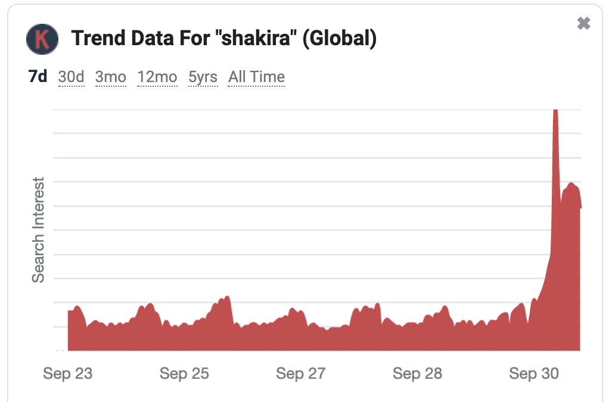

# Epidemiological Expectations in Economics
### Chris Carroll and Tao Wang

[An example of what this project is not about about](https://www.google.com/search?q=shakira+attacked+by+wild+boars+in+park):

## _The Guardian_

# __Shakira says two wild boars attacked her in Barcelona park__

_Sharing a video of her torn bag covered in mud, she explained in Spanish:  "Look how they left my bag, the two wild boars that attacked me in the park," the singer said, ... "They were taking my bag to the woods with my phone in it. They’ve destroyed everything,” she said._

We will not be examining compelling statistics tracking the internet activity of the keyword Shakira:

that demonstrate compellingly that this episode can be very well explained by the application of a "common source" model in which the initial population of the "infected" is Shakira's 70 million Instagram followers, who were the first to hear of the story because news of it first became public when she posted the story (with dramatic video and some great stills of the boars) on Instagram. Nor will we point out that the subsequent hump shape in the activity around the keyword is precisely the pattern predicted from the classic Susceptible-Infected-Recovered model that we presented yesterday.
